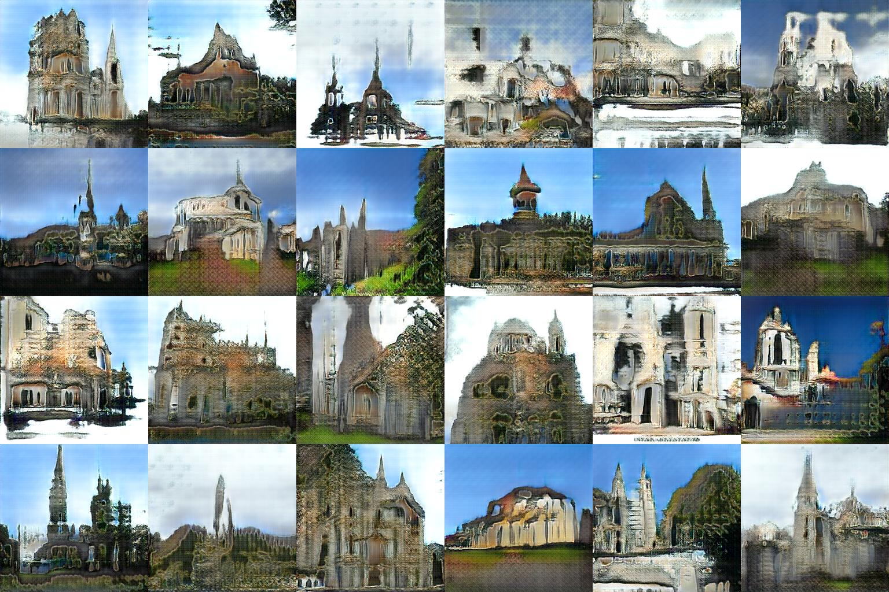

# PGGan-pytorch

> Author: Yuchao Gu

> E-mail: gyc.nankai@gmail.com

> Date: 2019-06-24

> Description: The code is an pytorch implementation of [《Progressive Growing of GANs for Improved Quality, Stability, and Variation》](https://arxiv.org/pdf/1710.10196.pdf)


---

## Usage

### Data Preparation

1. Download LSUN-church dataset
2. (Optional) create tfrecord dataset, scripts in dataset_tools/ are heavily copied from original tensorflow [implementation](https://github.com/tkarras/progressive_growing_of_gans)

### Training

1. (Optional) use Nvidia-Dali and Tfrecord to accelerate reading images.

``` python
python dataloader/create_DALI_tfrecord_idx.py
```

2. Train PGGans

``` python
python train.py
```

3. Pretrained PGGan generator can be downloaded [here](https://pan.baidu.com/s/1HMDQH_nP87uZ0rJeqK8Lgw), password:1c69

### Visualize


phase 128*128


phase 256*256




### Dependencies

This code depends on the following libraries:

* Python 3.6
* Pytorch 1.0.1
* PIL
* TensorboardX